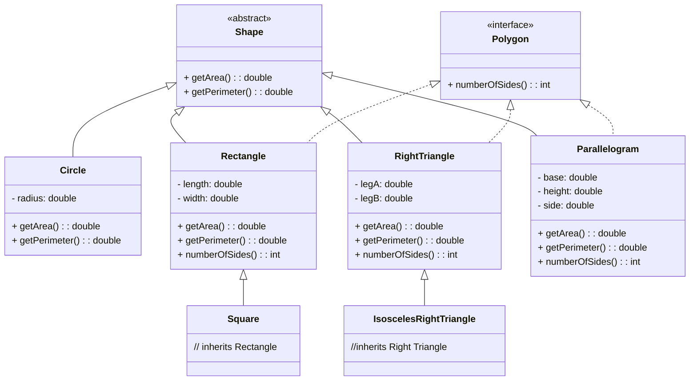

```mermaid
classDiagram
  %% === Interfaces ===
  class Polygon {
    <<interface>>
    + numberOfSides(): int
  }

  %% === Abstract Base Class ===
  class Shape {
    <<abstract>>
    + getArea(): double
    + getPerimeter(): double
  }

  %% === Concrete Classes ===
  class Circle {
    - radius: double
    + getArea(): double
    + getPerimeter(): double
  }

  class Rectangle {
    - length: double
    - width: double
    + getArea(): double
    + getPerimeter(): double
    + numberOfSides(): int
  }

  class Square{
    // inherits Rectangle
  }

  class RightTriangle {
    - legA: double
    - legB: double
    + getArea(): double
    + getPerimeter(): double
    + numberOfSides(): int
  }

  class IsoscelesRightTriangle{
    //inherits Right Triangle
  }

  class Parallelogram {
    - base: double
    - height: double
    - side: double
    + getArea(): double
    + getPerimeter(): double
    + numberOfSides(): int
  }

  %% === Inheritance Relationships ===
  Shape <|-- Circle
  Shape <|-- Rectangle
  Shape <|-- RightTriangle
  Shape <|-- Parallelogram

  Rectangle <|-- Square
  RightTriangle <|-- IsoscelesRightTriangle

  %% === Interface Implementations ===
  Polygon <|.. Rectangle
  Polygon <|.. RightTriangle
  Polygon <|.. Parallelogram
```
